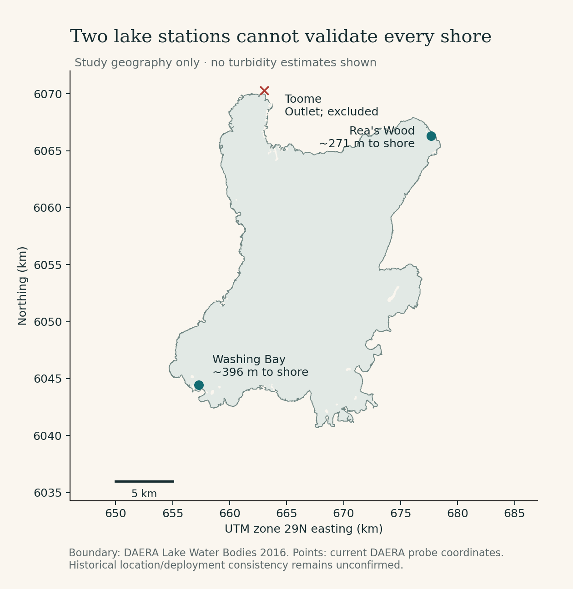
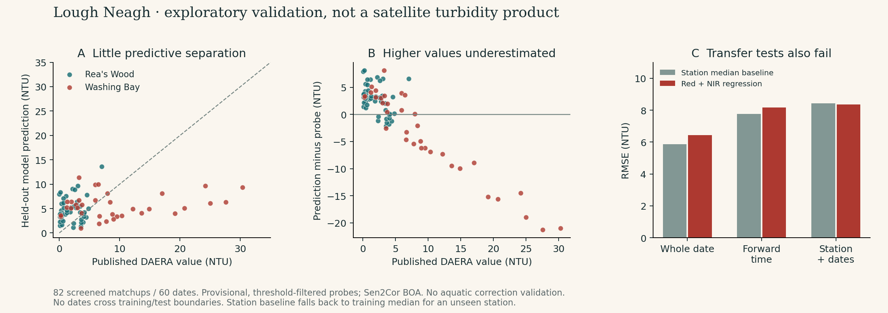

# Lough Neagh satellite turbidity: go/no-go report

**Decision, 24 September 2026: do not launch a satellite turbidity tracker from the presently available reference data and tested processing route.** No estimated NTU map, sector estimates, historical reconstruction or public website changes have been made.

Sentinel-2 can detect meaningful water-colour variation, and published research makes a better-calibrated Lough Neagh retrieval plausible. This investigation does **not** prove it impossible. It establishes that the tested generic surface-reflectance models have inadequate independent performance, that the public reference feed has consequential selection and quality limitations, and that two usable nearshore sites cannot establish accuracy across the proposed map. Relative turbidity or anomaly categories have not independently passed validation either.

Data were acquired on 23 September 2026; the final diagnostic analysis and review were completed on 24 September. The reference snapshot ends on 16 September, not the report date.

## What was actually done

- Inspected the existing Salmon of Data application: static React/Vinext, cached data, separate processing scripts and an established editorial design. The scientific stop condition was applied before presentation work.
- Reviewed primary remote-sensing literature, including Canadian Lake Saint-Pierre studies, atmospheric/adjacency correction research, Lough Neagh bloom studies and Copernicus/EOCIS documentation.
- Acquired **57,904 DAERA turbidity records** and **65,413 fluorescence records**, preserving nulls, duplicate timestamps, source IDs, original epoch times and hashes. The oldest turbidity observation is **6 January 2025**, despite the viewer launching in 2026.
- Archived the public Sentinel catalogue: **1,871 legacy L2A product records on 1,331 dates**, from November 2016 to September 2026. These are catalogue records, not usable lake observations or a complete mission archive. The contemporaneous Collection 1 search returned 355 records; removing processing duplicates left **345 scenes on 295 dates** for station screening.
- Retrieved actual pixel windows at all three published station coordinates. Built a **1,035-row candidate ledger**, with explicit rejection reasons and no temporal interpolation or offshore relocation.
- Resolved a material image-mirror scale/offset conflict through direct pixel comparisons and changed input collection. Matched identical 60 m footprints across native 10 m and 20 m bands.
- Evaluated eight prespecified simple models/baselines on the final **82 diagnostic matchups across 60 dates**, using whole-date, forward-time and station-plus-date holdouts.
- Completed an independent adversarial review, including independent recomputation of all 24 metric groups and 328 held-out predictions. Fourteen scientific regression tests pass.

The retained matchups cover 30 March 2025–8 September 2026: 47 at Rea's Wood across 42 dates, and 35 at Washing Bay across 30 dates. Dates shared by stations are counted once in the combined 60-date total. Published probe values in this selected subset span approximately 0.009–30.3 NTU; that is **not a validated prediction range**.

## What prevents publication

### The public reference feed is selected and provisional

The [DAERA service schema](https://services-eu1.arcgis.com/kswen6BYexuc1SUk/arcgis/rest/services/DAERA_Probes_and_Metrics_Master_Layers_View/FeatureServer/1?f=json) applies `threshold_exceeded = 'N'`, `Published = 'Y'` and `reviewed = 'Y'`. Those fields and the threshold rules are not exposed with the observations. All three stations' published maxima lie just below 40 NTU. That combination suggests upper-range screening; the exact rule is unknown. It would be wrong to infer that actual lake turbidity never exceeds 40 NTU or that missingness is random.

The downloaded data also contain 11,202 exact-zero turbidity values, long continuous zero runs, nulls and conflicting duplicate timestamps. These are retained as evidence, not automatically declared instrument faults or accepted as calibration truth. The [DAERA FAQ](https://www.daera-ni.gov.uk/articles/lough-neagh-water-quality-dashboard-faq) identifies the observations as non-validated. Its approximate 0.5 m sampling depth is relevant, but does not make the probe and optical surface layer identical samples.

Current station metadata list commissioning dates in early 2026 while the records begin in 2025. Historical coordinate, sensor and deployment consistency therefore remains unconfirmed. The source's UTC metadata were respected; logger timekeeping still needs provider confirmation. See the [full DAERA audit](daera-data-audit.md).

### Spatial validation is insufficient

Both DAERA and EEA lake geometries place Rea's Wood about 271 m and Washing Bay about 396 m inside the mapped shore. The published Toome coordinate is outside the lake polygon, approximately 339 m from its boundary, in the outlet area. It also yields no acceptable all-water SCL neighbourhoods in the screened archive. It was excluded rather than moved offshore.

Two nearshore locations cannot establish error at Ballyronan, Ardboe, Maghery, Oxford Island, the eastern shore or the open lake. No sector boundaries were invented to imply validation at these places. Shore distance and station identity are confounded in the available sample.

### The tested spectral models do not add robust predictive value

The following are **out-of-fold diagnostics against provisional published probe values**, not claimed satellite-product accuracy. All rows from a UTC date remain together, including multiple spacecraft and stations. No test labels enter fitting or scaling.

| Whole-date holdout model | MAE (NTU) | RMSE (NTU) | Bias (NTU) | R² |
|---|---:|---:|---:|---:|
| Training median | 4.05 | 6.92 | −2.08 | −0.11 |
| Station median, fitted on training dates | **3.68** | **5.87** | −1.31 | **0.20** |
| Seasonal sine/cosine baseline | 4.44 | 6.69 | −0.02 | −0.04 |
| Red reflectance | 4.58 | 6.65 | 0.01 | −0.02 |
| NIR reflectance | 4.69 | 6.76 | 0.02 | −0.06 |
| Red + NIR | 4.70 | 6.43 | −0.03 | 0.04 |
| Red / green | 4.70 | 6.65 | −0.03 | −0.02 |
| NIR / red | 4.66 | 6.66 | −0.03 | −0.03 |

The station-median baseline uses location identity but no satellite information. No spectral candidate beats it on either MAE or RMSE in the date holdout. The red-plus-NIR model has near-zero pooled bias because opposite station biases cancel: about **+2.8 NTU at Rea's Wood and −3.8 NTU at Washing Bay**. For the eleven retained observations at or above 10 NTU, its average underprediction is about 13.5 NTU. Ten NTU is a diagnostic split here, not a water-quality category.

| Red + NIR stress test | Test rows / dates | MAE | RMSE | Bias | R² |
|---|---:|---:|---:|---:|---:|
| Whole dates held out | 82 / 60 | 4.70 | 6.43 | −0.03 | 0.04 |
| Forward temporal blocks | 53 / 36 | 5.57 | 8.17 | −3.15 | −0.18 |
| Station and all its dates held out | 82 / 60 | 6.35 | 8.35 | −0.15 | −0.61 |

Giving each date equal weight does not rescue the red-plus-NIR result: date-balanced MAE/RMSE are 4.84/6.60 NTU. A 500-replicate date-cluster bootstrap gives a conditional MAE interval of approximately 3.83–5.63 NTU. That interval quantifies sampling variability of these fixed out-of-fold errors; it does not include atmospheric, reference, model-fitting or selection uncertainty. It is not a per-pixel prediction interval.

The post-current-commissioning subset has 40 matchups on 26 dates; red-plus-NIR R² falls to −0.41. A stricter red-band spatial CV screen also fails to demonstrate useful improvement. A 200 m shore buffer retains the same rows; 300 m removes Rea's Wood entirely and changes the population, so it is not a clean adjacency experiment. Residuals vary by station, season and target level. Fluorescence and tile cloud cover have descriptive residual associations; neither establishes causation or an effective correction. View/sun angles are tile-level metadata, not per-pixel glint validation.

Full outputs: [metrics CSV](../../data/lough-neagh/derived/exploratory-metrics.csv), [validation JSON](../../data/lough-neagh/derived/exploratory-validation.json), [all candidate rows](../../data/lough-neagh/derived/candidate-matchups.csv), [retained matchups](../../data/lough-neagh/derived/exploratory-matchups.csv), [out-of-fold predictions](../../data/lough-neagh/derived/exploratory-predictions.csv).

## What remains untested, and why

The numerical experiment uses **Sen2Cor bottom-of-atmosphere reflectance**, not independently checked aquatic water-leaving reflectance. Its failure must not be represented as failure of all Sentinel turbidity retrievals. ACOLITE/Polymer/iCOR processing and field radiometry are credible next experiments once reference data are made fit for purpose.

Published Nechad/Dogliotti algorithms require appropriate aquatic reflectance, sensor-specific coefficients and unit conventions. Substituting generic BOA into them would not provide a fair scientific benchmark; those scores were therefore not manufactured. FNU outputs also cannot simply be relabelled NTU. Machine learning was not pursued because more flexible fitting would not repair reference selection, atmospheric ambiguity or missing spatial validation.

The Copernicus 100 m product is a serious benchmark candidate, but uses 10-day composites. Authenticated raster access is needed, and actual Neagh pixel coverage and local performance were not established from catalogue metadata. The inspected EOCIS archive supplies real 2016–2023 Neagh products, but has no overlap with these probes; its sample lacks quality/mask arrays and has ambiguous turbidity-unit metadata. Neither product was rejected as physically incapable. See the [product audit](copernicus-audit.md) and [literature review](literature-review.md).

The investigation stops at the publication gate. **Historical NTU processing, sector statistics, three website tabs and automated publishing are deliberately not implemented.** Nor are colour anomalies relabelled as turbidity to bypass the failed gate. The existing website remains unchanged.

## What could make a defensible tracker possible

1. Obtain complete, quality-documented probe records, including screened observations, flags and threshold rules; resolve zeros, duplicate readings, maintenance, historical deployments, logger timing and instrument method. An [unsent data-request draft](data-request.md) specifies the requirements.
2. Obtain independently validated observations across the intended shores and offshore water, including turbid events and bloom/non-bloom conditions. Coincident water-leaving radiometry, suspended solids, chlorophyll/phycocyanin and depth/clarity observations help distinguish atmosphere, sediment, algae and bottom effects.
3. Compare aquatic atmospheric corrections and spectrally appropriate published retrievals against simple local models and the existing Copernicus product, using untouched date and spatial holdouts. Define useful error tolerance and uncertainty coverage for the intended public interpretation before examining final tests.
4. If only relative changes pass independent tests, explicitly design that product and validate its ranking/change accuracy. Do not assume classification is reliable because its labels are less precise.
5. Only after a positive decision, create versioned offshore sector polygons, process the archive within the validated domain, serve cached tiles/statistics and activate a QA-controlled update pipeline. The [continuation design](continuation-design.md) records this route without claiming it has been built.

The independent [adversarial review](independent-review.md) agrees with this scoped no-go decision. This is a reproducible negative result for the tested pipeline and a concrete route to a better experiment, not a declaration that satellite monitoring of Lough Neagh cannot work.

For exact software, commands, frozen inputs and provenance, see [reproduction instructions](REPRODUCE.md).

The [Sentinel audit](sentinel-audit.md) documents mission/band characteristics, actual catalogue coverage, native pixel support, the corrected scale/offset problem and geographic source lineage.
